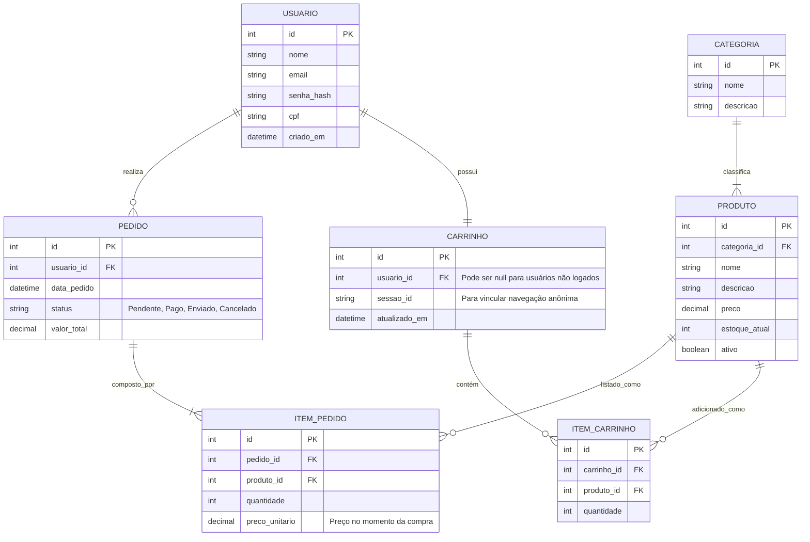
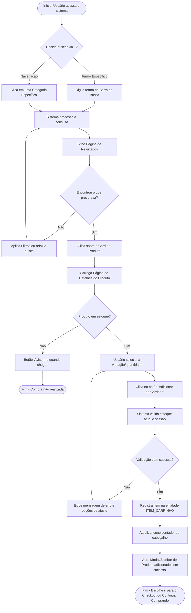

# Diagramas Mercadex

## 1. Diagrama de Entidade-Relacionamento (ER)

Neste diagrama ER, além das entidades `Usuário`, `Produto` e `Pedido`, estão as entidades de suporte fundamentais para um e-commerce: `Categoria` (para organizar os produtos), `ItemPedido` (para quebrar o relacionamento N:M entre Pedidos e Produtos, guardando o valor histórico na hora da compra), `Carrinho` e `ItemCarrinho`.

## 2. Diagrama de Fluxo de Navegação (Busca ao Carrinho)

Este fluxograma ilustra o caminho (User Journey) de um cliente desde o momento em que decide procurar um produto até finalizar a ação de colocá-lo no carrinho, prevendo caminhos alternativos e feedbacks visuais do sistema.

