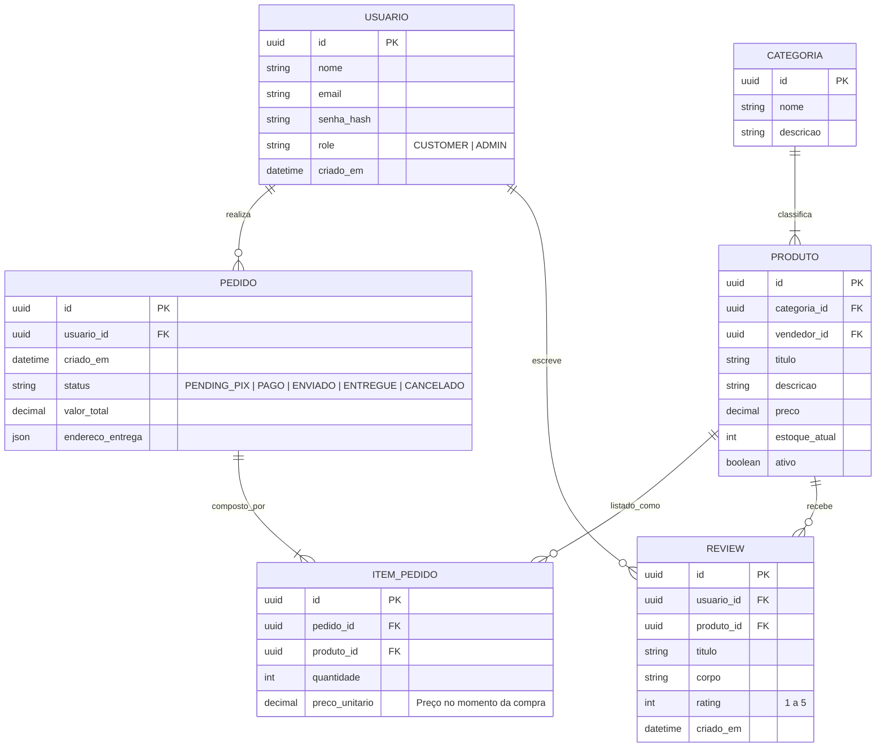
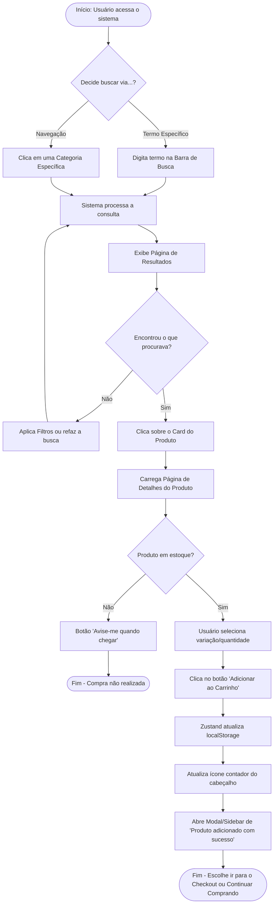
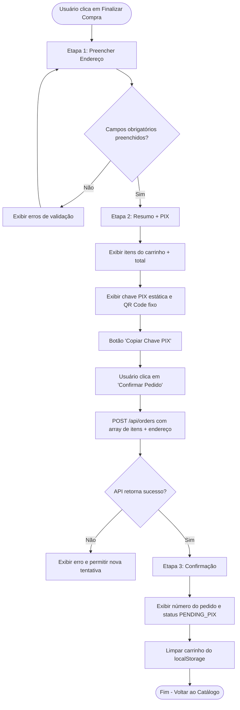

# Diagramas Mercadex

## 1. Diagrama de Entidade-Relacionamento (ER)

Neste diagrama ER estão as entidades ativas do MVP Lean. O `Carrinho` é gerenciado 100% via `localStorage` no frontend e **não possui tabela no banco** (ver ADR-007). A entidade `REVIEW` é nova neste pivot e sustenta as features de IA (Resumo + Chat).

> **@legacy — Carrinho no banco:** Os models `Cart` e `CartItem` foram desativados (MVP Lean).
> O array de itens é enviado diretamente do frontend para `POST /api/orders`.
> Ver schema.prisma para os models comentados.

## 2. Diagrama de Fluxo de Navegação (Busca ao Carrinho)

Este fluxograma ilustra o caminho (User Journey) de um cliente desde o momento em que decide procurar um produto até finalizar a ação de colocá-lo no carrinho, prevendo caminhos alternativos e feedbacks visuais do sistema.

## 3. Diagrama de Fluxo de Checkout (PIX Estático)

Fluxo simplificado do MVP Lean: carrinho do `localStorage` → endereço de entrega → PIX estático → pedido criado com `PENDING_PIX`.

## 4. Diagrama de Fluxo de Reviews e IA

Fluxo das features de inteligência: review de produto, resumo IA e chat stateless.

```mermaid
flowchart TD
    subgraph Review
        A([Usuário logado na página do produto]) --> B[Clica em Escrever Avaliação]
        B --> C[Preenche título, descrição e nota 1-5]
        C --> D[POST /api/products/:id/reviews]
        D --> E[Review salvo e exibido na lista]
    end

    subgraph Resumo_IA
        F([Qualquer visitante na página do produto]) --> G[Clica em Ver Insight da IA]
        G --> H[GET /api/products/:id/ai-summary]
        H --> I{Reviews existem?}
        I -- Não --> J[Exibir 'Ainda sem avaliações para resumir']
        I -- Sim --> K[Backend envia reviews para LLM]
        K --> L[LLM retorna resumo de 3 frases]
        L --> M[Exibir resumo na UI]
    end

    subgraph Chat_Produto
        N([Visitante clica em Tirar Dúvida]) --> O[Abre drawer de chat]
        O --> P[Usuário digita pergunta]
        P --> Q[POST /api/products/:id/chat com mensagem]
        Q --> R[Backend carrega specs + reviews + chama LLM]
        R --> S[LLM responde baseado no contexto do produto]
        S --> T[Exibir resposta no chat React-only]
        T --> U{Mais perguntas?}
        U -- Sim --> P
        U -- Não --> V([Fechar chat - histórico descartado])
    end
```

