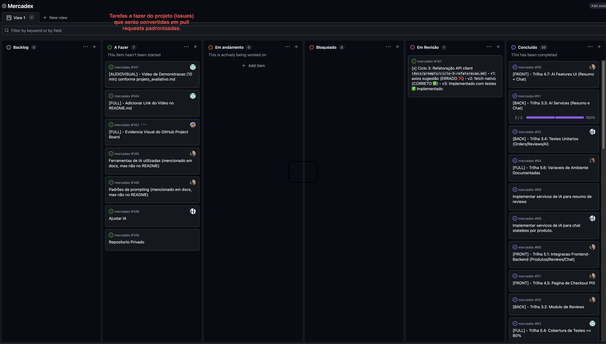

## LINK PROJETO

https://github.com/users/cbfn/projects/1/views/1

## Importância do Quadro de Projeto

O quadro GitHub Projects organiza o trabalho em colunas que refletem o ciclo de vida de cada tarefa:

- **Backlog** — repositório de tudo que foi levantado mas ainda não priorizado.
- **A Fazer** — itens prontos para serem iniciados na próxima iteração.
- **Em Andamento** — tarefas sendo desenvolvidas ativamente; limitar o WIP evita acúmulo.
- **Bloqueado** — evidencia impedimentos antes que afetem o prazo, forçando resolução rápida.
- **Em Revisão** — código em PR aguardando review; separa "feito" de "validado".
- **Concluído** — histórico auditável do que foi entregue e quando.

Essa visão centralizada elimina dependência de comunicação informal, torna o progresso transparente para toda a equipe e facilita a identificação de gargalos em tempo real.
